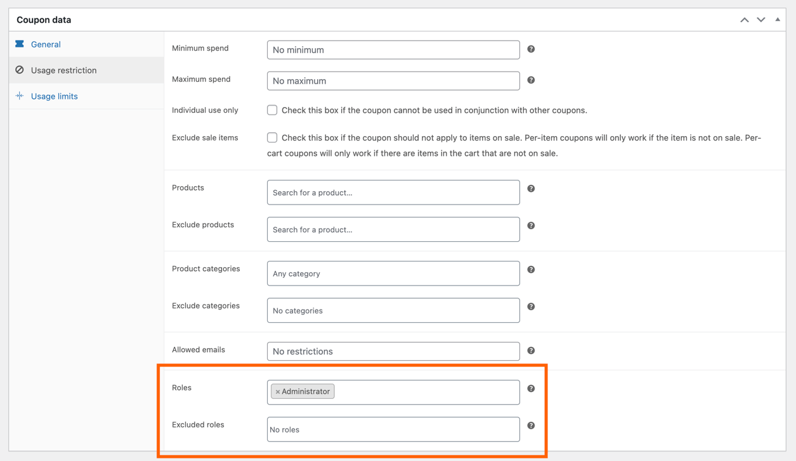
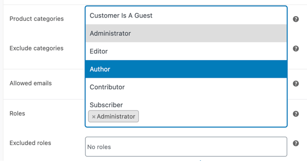
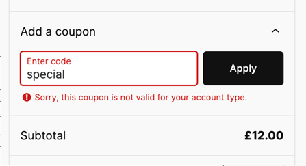

# Coupons Role Restriction for WooCommerce

Restrict the usage of WooCommerce coupons based on user roles.

## Description

This plugin allows you to restrict the usage of WooCommerce coupons based on user roles. You can specify which roles are allowed or excluded from using a coupon, providing more control over your discount strategies.

## Features

- Restrict coupon usage based on user roles.
- Option to specify both allowed and excluded roles.
- Customize the error message via a filter.

## Installation

1. Upload the plugin files to the `/wp-content/plugins/runthings-wc-coupons-role-restrict` directory, or install the plugin through the WordPress plugins screen directly.
2. Activate the plugin through the 'Plugins' screen in WordPress.
3. Go to WooCommerce > Coupons and edit or create a coupon.
4. In the "Usage restriction" tab, you will see the options to select allowed and excluded roles for the coupon.

## Frequently Asked Questions

### Why was this plugin created?

This plugin was created to provide a more secure option for restricting coupon usage. The default email usage restriction for coupons in WooCommerce is based on the unverified billing email address field, which can be freely set by users. By using role restrictions, you can ensure that only verified and authorized users in specific roles can use certain coupons, making it a secure option.

My personal motivation was to have 100% discount coupons that could be used only be staff or developers, without the possibility of this being exploited by somebody putting a fake staff email into the billing email address field.

### How do I restrict a coupon to specific roles?

Edit the coupon and go to the "Usage restriction" tab. In the "Roles" section, select the roles allowed to use the coupon. If you want to exclude specific roles, select them in the "Excluded roles" section.

### What happens if a role is both allowed and excluded?

If a role is both allowed and excluded, the exclusion will take precedence, and users with that role will not be able to use the coupon.

### Can I use this plugin with other WooCommerce coupon restrictions?

Yes, this plugin works alongside other WooCommerce coupon restrictions such as minimum spend, maximum spend, and product restrictions.

## Screenshots

1. Coupon settings page with role restriction fields.
   

2. Coupon role selection field
   

3. Example denied coupon usage due to invalid role
   

## Filters

### runthings_wc_coupons_role_restrict_error_message

This filter allows customization of the error message shown when a coupon is not valid for the user's account type.

**Usage:**

```php
add_filter('runthings_wc_coupons_role_restrict_error_message', 'custom_coupon_error_message');

function custom_coupon_error_message($message) {
    return 'Custom error message for invalid coupon.';
}
```

## Changelog

### 1.0.0 - 11th July 2024

- Initial release.
- Restrict coupons by role
- Allow coupons by role
- Filter `runthings_wc_coupons_role_restrict_error_message` to customise error message

## License

This program is free software; you can redistribute it and/or modify it under the terms of the GNU General Public License as published by the Free Software Foundation; either version 3 of the License, or (at your option) any later version.

This program is distributed in the hope that it will be useful, but WITHOUT ANY WARRANTY; without even the implied warranty of MERCHANTABILITY or FITNESS FOR A PARTICULAR PURPOSE. See the GNU General Public License for more details.

You should have received a copy of the GNU General Public License along with this program; if not, see [http://www.gnu.org/licenses/gpl-3.0.html](http://www.gnu.org/licenses/gpl-3.0.html).

Icon - Discount by Gregor Cresnar, from Noun Project, [https://thenounproject.com/browse/icons/term/discount/](https://thenounproject.com/browse/icons/term/discount/) (CC BY 3.0)

Icon - restriction by Puspito, from Noun Project, [https://thenounproject.com/browse/icons/term/restriction/](https://thenounproject.com/browse/icons/term/restriction/) (CC BY 3.0)
